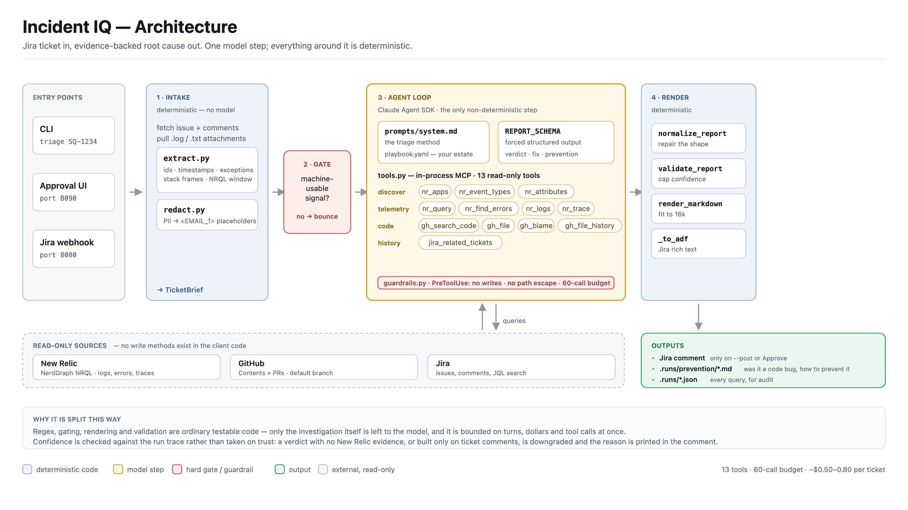
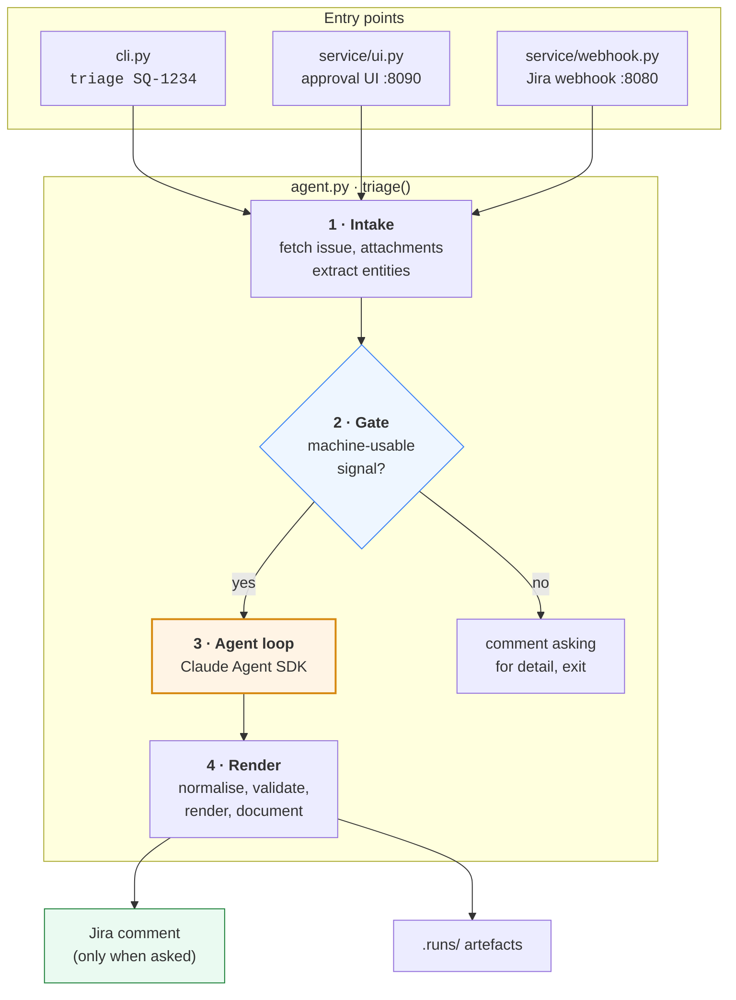
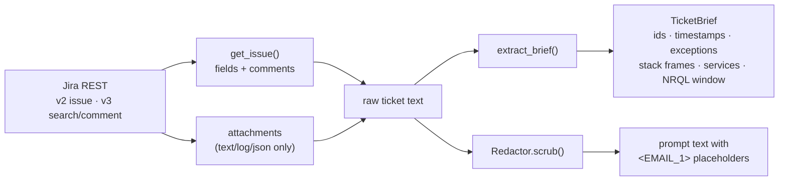
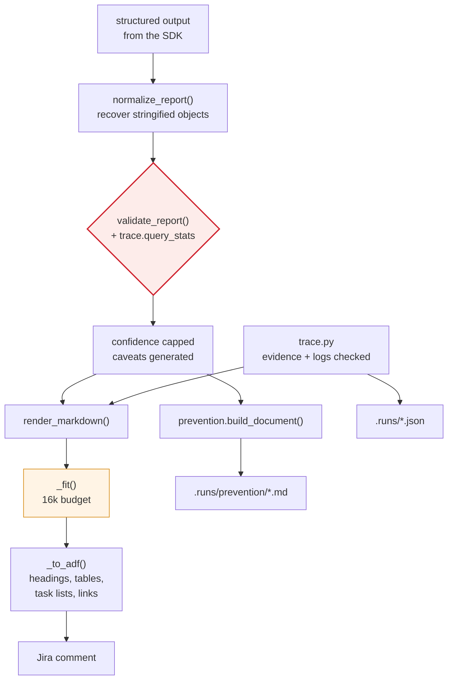
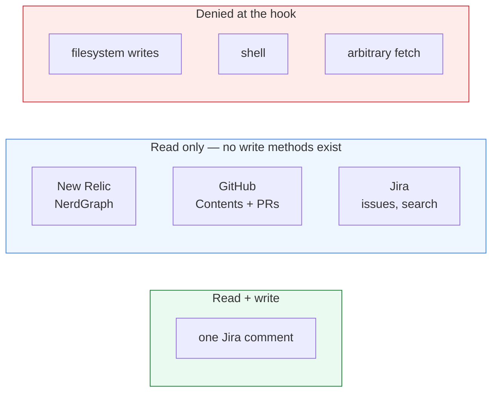
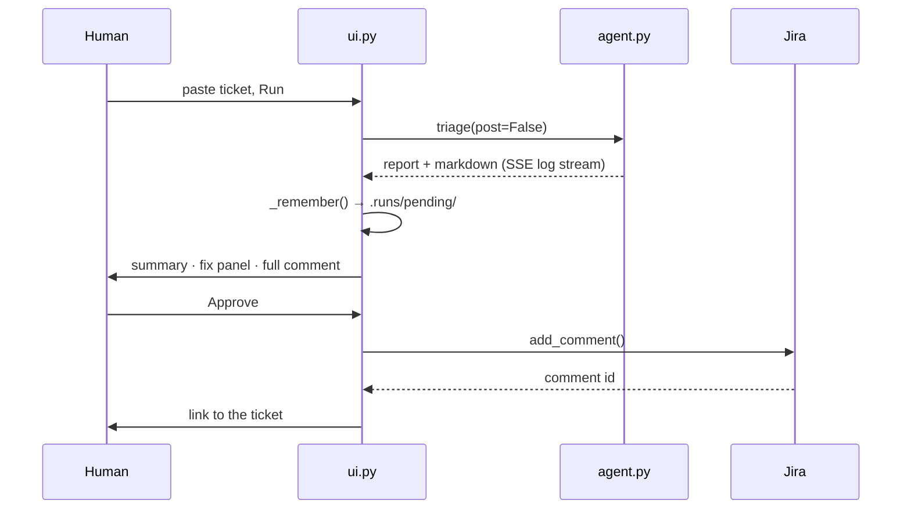

# Architecture

How Incident IQ is put together, and why the pieces are split the way they are.

For setup and commands see [RUNNING.md](RUNNING.md). For the design rationale
behind individual decisions see [README.md](README.md).

---

## 1. The shape of it

*Slide-ready copies: [`docs/architecture.png`](docs/architecture.png) (3200×1800)
and [`docs/architecture.svg`](docs/architecture.svg) (vector). Regenerate with
`python3 docs/make_architecture_diagram.py` after changing the system.*

One deterministic pipeline with a single non-deterministic step in the middle.
Everything before and after the agent loop is ordinary code you can unit-test,
which is what makes the output auditable.

The agent loop is the only part that can surprise you, and it is bounded on
three axes at once: turns, dollars, and tool calls.

---

## 2. Modules

| Module | Responsibility |
|---|---|
| `agent.py` | Orchestration. Owns the four phases and the SDK session. |
| `config.py` | `Settings.from_env()` + `Playbook` YAML loading. No hardcoded estate knowledge. |
| `extract.py` | Deterministic pre-extraction: IDs, timestamps, exceptions, stack frames. Also the gate. |
| `redact.py` | Stable pseudonymisation on the way in, reversal on the way out. |
| `tools.py` | The agent's 13-tool surface, as an in-process MCP server. |
| `guardrails.py` | `PreToolUse` hook: denies writes, path escapes, over-budget calls. |
| `trace.py` | Records every call; renders the evidence appendix and the log-coverage table. |
| `schema.py` | The report contract, the confidence validator, and the markdown renderer. |
| `prevention.py` | Assembles the prevention document from the report. |
| `simplify.py` | Second, tool-free model call: conversational prose for the UI. |
| `clients/` | `jira`, `newrelic`, `github` — thin, read-only, no write methods. |

---

## 3. Phase 1 — Intake (deterministic)

Two things worth knowing here:

**Regex work happens in code, not in the model.** The model's turns are spent
reasoning, not parsing. `extract_brief` also derives the NRQL time window from
the ticket's own timestamps, so the agent isn't left defaulting to 24 hours.

**Comments are labelled as hearsay.** `JiraIssue.as_prompt_text()` presents them
under an explicit "UNVERIFIED CLAIMS BY PEOPLE, NOT EVIDENCE" heading. Handed
over neutrally, a confident comment becomes the model's conclusion and the whole
run degenerates into a paraphrase of the ticket.

---

## 4. Phase 2 — The gate

`brief.is_triageable` is true when there is either an error signature
(exception, stack frame, HTTP status) or a subject (a domain identifier). If
neither is present there is nothing to correlate against, and the run is
bounced before a single dollar is spent.

---

## 5. Phase 3 — The agent loop

```mermaid
flowchart TB
    SDK["ClaudeSDKClient"]

    subgraph inputs["Inputs"]
        SYS["prompts/system.md<br/>the method"]
        PB["playbook YAML<br/>estate knowledge"]
        SCH["REPORT_SCHEMA<br/>output contract"]
    end

    subgraph tools["tools.py · in-process MCP"]
        direction TB
        DISC["<b>Discovery</b><br/>nr_apps · nr_event_types<br/>nr_attributes"]
        NR["<b>Telemetry</b><br/>nr_query · nr_find_errors<br/>nr_logs · nr_trace"]
        GH["<b>Code</b><br/>gh_search_code · gh_file<br/>gh_blame · gh_file_history<br/>gh_pr_for_commit"]
        JR["<b>History</b><br/>jira_related_tickets"]
    end

    HOOK{"guardrails.py<br/>PreToolUse"}

    SYS --> SDK
    PB --> SDK
    SCH --> SDK
    SDK <--> HOOK
    HOOK -- allowed --> tools
    HOOK -- denied --> SDK
    tools --> TRACE["trace.py<br/>RunTrace"]

    style HOOK fill:#fdecea,stroke:#cf222e,stroke-width:2px
    style DISC fill:#eef6ff,stroke:#3b82f6
```

### Discovery before filtering

The discovery tools exist because `appName` is the single biggest source of
false negatives. Repo name, service name and New Relic app name are all
different, and a guessed `appName` returns zero rows that look exactly like
"nothing is broken". `nr_logs` goes further: it checks whether the window holds
any log volume at all, then works out which attribute actually identifies a
service, because log shippers disagree (`appName` vs `service.name` vs
`kubernetes.containerName`).

### Guardrails

Every tool call passes through one `PreToolUse` hook:

| Gate | Behaviour |
|---|---|
| Mutating tools | `Write`, `Edit`, `Bash`, `NotebookEdit`, `WebFetch` — denied outright |
| Path escape | `Read`/`Grep`/`Glob` outside the configured repo roots — denied |
| No local clone | Those three denied entirely, with a pointer to the `gh_*` tools |
| Budget | 60 tool calls; `StructuredOutput` stays allowed so the write-up can still land |

`can_use_tool` is *not* where this lives: it only fires when the permission flow
falls through to a prompt, and anything auto-approved by `allowed_tools` never
reaches it. `PreToolUse` fires on every call.

### NRQL is repaired, not just validated

`clients/newrelic.py` does more than gatekeeping:

- The mutation guard matches keywords against a **literal-stripped** copy, so an
  endpoint named `.../create` is not mistaken for a write.
- `SELECT count(*), error.class` — valid SQL, invalid NRQL — is repaired by
  moving the attribute into `FACET`, and the agent is told what changed.
- Absolute `SINCE`/`UNTIL` bounds without a UTC offset raise a warning.
- Empty result sets come back with an explicit note that absence of data is not
  evidence of absence.

---

## 6. Phase 4 — Render and hand off

### Confidence is not taken on trust

The model declares which of three signals it stood on — logs, code, data — and
`validate_report()` checks that claim against the run trace. It downgrades when:

- fewer than two signals were confirmed
- every data query came back empty, or New Relic was never queried
- the evidence is entirely `source: "jira"` (a paraphrase, not a diagnosis)

Downgrades are **printed in the comment**, never applied silently, so the reader
can see why a claim was reduced.

### The comment is fitted, not truncated blindly

Jira rejects a comment over 32,767 characters with `CONTENT_LIMIT_EXCEEDED` and
posts *nothing*. `_fit()` therefore sacrifices the appendix first: the diagnosis
is only reproducible from the comment, while the query list is reproducible from
the run trace. The budget is set against ADF, which serialises to roughly 1.8x
the markdown.

---

## 7. Outputs

| Artefact | Contents |
|---|---|
| Jira comment | Plain summary → recommended fix → checklist → caveats → technical detail → evidence → prevention → "in short" |
| `.runs/<ticket>-<run>.json` | Every tool call, arguments, row counts, permalinks |
| `.runs/prevention/<ticket>-<run>.md` | Was it a code bug, what to change, how to detect it, runbook entry |
| `.runs/pending/<run>.json` | Reports awaiting approval, so `--reload` cannot lose them |

The comment is ordered for the widest reader first: a support lead should get
the whole picture before reaching anything containing a file path.

---

## 8. Trust boundaries

The security boundary is the client code, not the prompt: `clients/github.py`
and `clients/newrelic.py` have no write methods to call. The Jira comment is the
only side effect this system can produce, and it requires either `--post` on the
CLI or a human clicking **Approve** in the UI.

---

## 9. The three entry points

- **CLI** — one process per run, so it always picks up the latest prompt and
  schema. The right loop while tuning.
- **UI** — always runs with `post=False`; `POST /api/approve` is the only path
  that calls `add_comment`. Pending reports are mirrored to disk because
  `--reload` restarts the worker on every file save.
- **Webhook** — label-gated (`auto-triage`) and concurrency-limited to 3, so it
  can be rolled out to a subset rather than the whole project.

---

## 10. Where to change things

| You want to… | Edit |
|---|---|
| Teach it about a service, app name or ID format | `config/playbooks/eps.yaml` |
| Change how it investigates | `prompts/system.md` |
| Add or narrow a capability | `src/triage/tools.py` |
| Change what the report must contain | `REPORT_SCHEMA` in `schema.py` |
| Change how the comment reads | `render_markdown()` in `schema.py` |
| Tighten what the agent may do | `src/triage/guardrails.py` |

The playbook is almost always the right answer when the agent guesses wrong
about your estate. Reach for the prompt only when the *method* is wrong.
